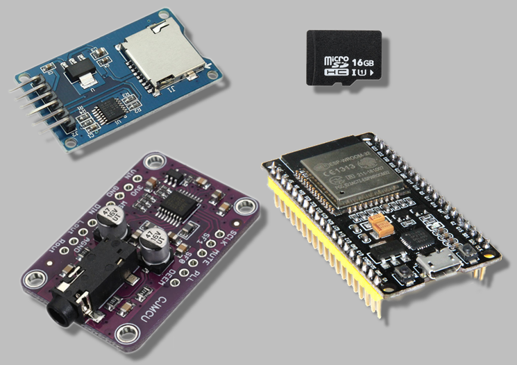
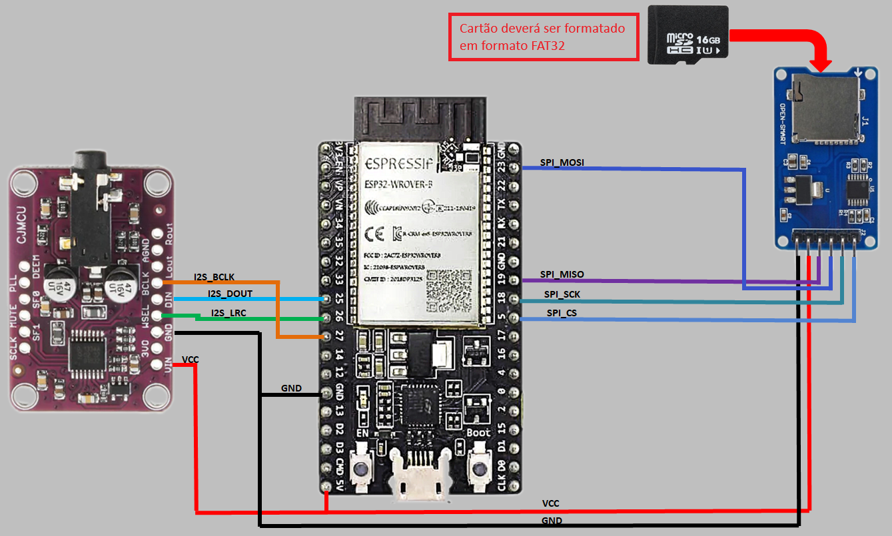

# ESP32 Audio Player com ESP8266Audio

Este projeto demonstra como usar um ESP32 para reproduzir arquivos MP3 armazenados em um cartão SD usando a biblioteca [ESP8266Audio](https://github.com/earlephilhower/ESP8266Audio). A saída de áudio é gerada através da interface I2S.



## 🚀 Recursos Utilizados

-   **ESP32**
-   **Cartão SD**
-   **Biblioteca ESP8266Audio**
-   **Saída de áudio I2S**

## 📦 Componentes Necessários

-   ESP32
-   Cartão SD **(Formatado em FAT32)** e módulo de leitura
-   Amplificador de áudio ou DAC com suporte a I2S
-   Alto-falante
-   Cabos para conexão

## 🛠️ Conexões




## 🧑‍💻 Código Fonte

O código principal realiza as seguintes funções:

-   Inicializa o cartão SD via SPI.
-   Verifica o tipo de cartão e exibe os arquivos disponíveis.
-   Configura a comunicação I2S.
-   Reproduz um arquivo MP3 nomeado `musica.mp3` do cartão SD.
-	**Obs.:** o cartão precisará estar no formato FAT32 (ou FAT talvez, não testei) e o arquivo mp3 precisará estar nomeado conforme acima: `musica.mp3`

### Principais Bibliotecas Utilizadas
-   `Arduino.h`
-   `AudioGeneratorMP3.h`
-   `AudioOutputI2S.h`
-   `AudioFileSourceSD.h`
-   `SD.h`
-   `SPI.h`

## 📥 Instalação

1.  Clone este repositório:
    
    ```bash
    git clone https://github.com/jonkstro/esp32-cjmcu1334-microsd-audio.git
    
    ```
    
2.  Abra o arquivo no Arduino IDE.
3.  Instale as bibliotecas necessárias através do Gerenciador de Bibliotecas.
4.  Carregue o código para o ESP32.

## 🎵 Reprodução de Áudio

-   Certifique-se de que o cartão SD tenha um arquivo chamado `musica.mp3` na raiz e que esteja formatado como FAT32.
-   Conecte o módulo CJMCU1334 aos pinos I2S configurados.
- Conecte o plugue do  módulo DAC ao fone de ouvido
-   O áudio será reproduzido automaticamente.

## 🛡️ Licença

Este projeto está licenciado sob a **MIT License**. Sinta-se à vontade para modificar e compartilhar.

## 📧 Contato

Caso tenha dúvidas ou sugestões, entre em contato pelo GitHub.

**Divirta-se ouvindo sua música favorita com o ESP32! 🎧**